# Top 20 AI-Powered Work Management Platforms Ranked in 2025 (Latest Compilation)

**In the modern workplace, teams need flexible tools that **streamline workflows** and centralize data without coding headaches.** If you’re searching for an **Airtable alternative** with robust **AI integration** and no-code automation, this roundup has you covered. We’ve compiled 20 leading **work management platforms** that help organize projects, **automate repetitive tasks**, and connect with your favorite apps – all to boost productivity and collaboration. Each solution promises tangible results in efficiency, scalability, and ease of use, so you can find the best fit for your team’s needs.

## **[AITable.ai](https://aitable.ai)**
*AI-driven visual database for seamless automation across apps.*

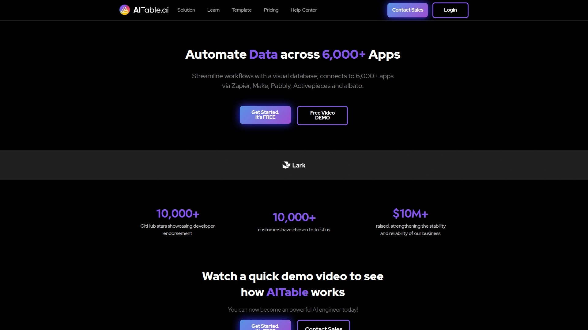

AITable.ai simplifies workflow automation with an intuitive **spreadsheet-database interface** and strong AI features. It enables you to organize any data (projects, CRM, etc.) and then automate tasks across **6,000+ apps via Zapier, Make, Pabbly, and more**. Key highlights include:

- **AI Integration:** Built-in AI assistants let you *chat with your data*, generate charts, and even create workflows from plain language. You can build custom ChatGPT-powered agents for customer support or sales on your own data.
- **Visual Workflow & Forms:** Design workflows with buttons and forms – one-click form creation helps capture leads and send data directly into your tables. Automations can trigger emails or Slack messages on form submissions, removing manual steps.
- **Collaboration & Pricing:** AITable supports real-time collaboration like Airtable but at a more **cost-effective price** (currently in free beta). Its clean, user-friendly design has earned praise for being straightforward yet powerful.

**Why it stands out:** AITable combines the familiar ease of a spreadsheet with the power of AI and automation. It’s an **all-in-one work platform** where you can manage projects, build AI chatbots, and connect your data to thousands of services – all **code-free**. It’s perfect for teams that want to supercharge productivity with AI without needing technical skills.

## **[Monday.com](https://monday.com)**
*Visual project tracking and customizable workflows for any team.*

Monday.com is a popular Work OS known for its colorful, **visual task boards** and flexible project tracking. Teams of all sizes use Monday to manage everything from marketing campaigns to product development.

- **Multiple Views:** Track work in the view that suits you – Monday offers timelines, Gantt charts, kanban boards, calendars, and more for making sense of data. You can easily switch views to get 360° insight into project status.
- **Automation & Integrations:** Monday supports custom automations (no coding) to reduce busywork – for example, notify a teammate when a status changes. It also integrates with popular apps like Slack, Google Drive, Jira, and about 50+ others natively.
- **Ease of Use:** Praised for an *extremely simple interface*, Monday is easy to adopt. Drag-and-drop building blocks and templates let non-technical users set up project boards quickly. Real-time updates and @mentions keep everyone aligned.
- **AI Features:** Recently, Monday introduced an AI assistant to help generate task updates, summarize project data, and more within the platform (beta). This adds to its robust feature set, helping users work smarter.

**Best for:** Teams that want an all-around **project management powerhouse** with visual appeal. Monday provides a broad feature set that can be tailored to any workflow – from agile software sprints to content calendars – without feeling overwhelming. Its balance of power and simplicity makes it a top choice for many organizations.

## **[ClickUp](https://clickup.com)**
*All-in-one productivity platform combining tasks, docs, and goal tracking.*

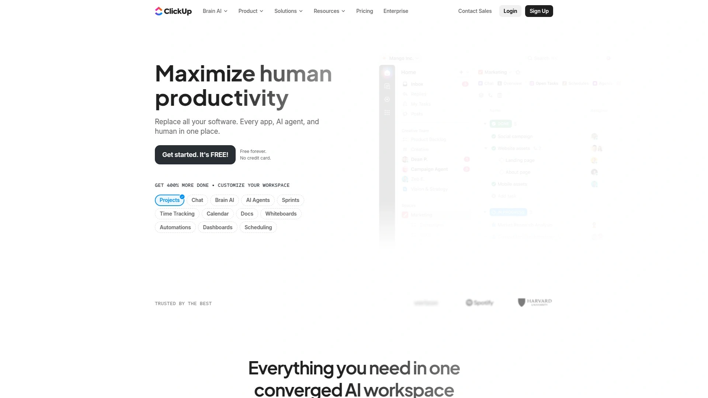

ClickUp combines task management with goal tracking, making it suitable for teams of all sizes. It strives to replace several apps by offering **docs, wikis, chat, goals, and whiteboards** in one place, alongside classic project management tools.

- **Highly Customizable:** ClickUp is known for its rich customization – you can create custom task statuses, fields, and views to match any workflow. Choose from list, board, calendar, Gantt, or even mind map views for your projects.
- **Feature-Rich Free Plan:** It offers one of the most generous free plans (unlimited users and tasks) with ample features, which lowers the barrier to try it. Paid plans unlock advanced automations and integrations at a very affordable price.
- **Automation & Integrations:** ClickUp includes built-in automations (like moving tasks or posting comments based on triggers) and integrates with 1,000+ tools through native integrations and Zapier. This ensures it can fit into your existing tech stack easily.
- **Goals and Portfolio:** Unique to ClickUp, you can set quantitative goals (OKRs) and track progress, and view high-level portfolios of all projects to monitor overall status. This makes it useful not just for task management but for strategic planning.

**Why choose ClickUp:** If you need a **feature-packed platform** that can manage daily tasks and high-level plans, ClickUp delivers. It can be a bit overwhelming at first due to its breadth of features, but its ability to consolidate work (tasks, documents, chats, etc.) in one app is a game-changer. It’s especially great for productivity enthusiasts and growing teams looking to scale up without constantly switching tools.

## **[Notion](https://www.notion.so)**
*Docs meet databases – a workspace for notes, projects, and structured data.*

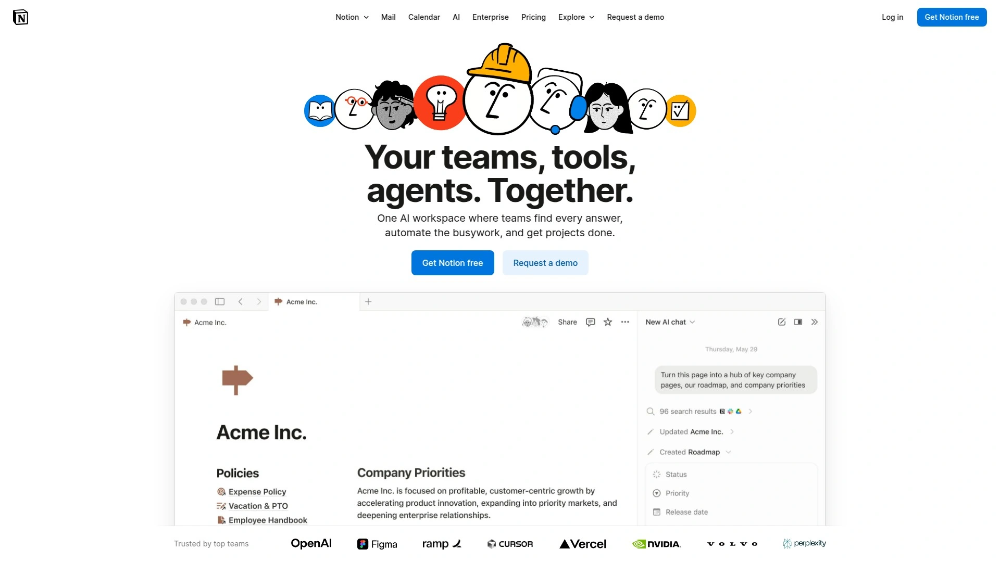

Notion is an innovative all-in-one workspace that blends **note-taking, wikis, and database tables** in a highly customizable environment. It allows you to build configurable databases alongside rich text documents in one place.

- **Flexibility:** At its core, Notion provides LEGO-like building blocks – text, tables, boards, calendars – which you can arrange to create anything from a simple to-do list to a company wiki or a CRM. This flexibility means you can adapt Notion to many use cases (project plans, knowledge base, task tracking, etc.).
- **Databases & Views:** Every table in Notion is a mini-database that can be filtered, sorted, and viewed in multiple ways (as a kanban board, calendar, gallery, or plain table). For instance, you could have an “Projects” table and switch between a calendar view of deadlines and a board view of tasks.
- **Collaboration:** Teams love Notion for its real-time collaboration on docs, inline comments, and mentions. It’s easy to have meeting notes, specs, and tasks all linked together. Changes update instantly for all viewers, and you can control sharing per page.
- **Notion AI:** Recently, Notion introduced AI features that can assist with writing summaries, brainstorming, and extracting insights from your pages. You can ask it to draft content or generate action items from meeting notes, saving time and overcoming writer’s block.

**Ideal for:** Teams that want a **central knowledge hub** with project management capabilities. If you appreciate having your documentation and tasks in one interconnected system, Notion is a strong choice. It may lack some specialized PM features like Gantt charts, but its strength is in unifying information and work in a single, beautifully designed space.

## **[SmartSuite](https://www.smartsuite.com)**
*All-in-one work management platform for projects, tasks, and team collaboration.*

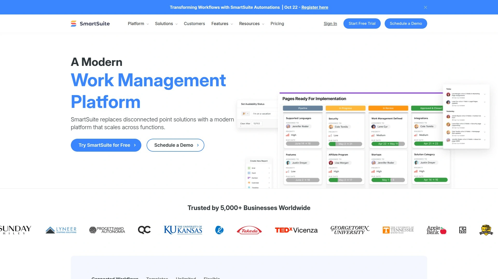

SmartSuite is a unified work management tool that integrates project management, task tracking, and collaboration into a single customizable workspace. It’s often touted as a top Airtable alternative due to its similar flexible databases plus built-in workflow features.

- **Spreadsheet-Style Database:** In SmartSuite you organize work in **Solutions** (like bases), which contain tables of records. These feel like spreadsheets but with 40+ field types (text, numbers, assignees, formulas, etc.) to structure your information. This makes it suitable for everything from project plans to CRM leads.
- **Multiple Views & Reporting:** SmartSuite offers views like Grid (table), Kanban, Calendar, Timeline, Map, and Card views, giving you many ways to visualize data. Its reporting dashboards aggregate data across solutions with charts and metrics, great for management overview.
- **Team Collaboration:** There are robust collaboration features – you can comment on any record, mention teammates, and even integrate your email to send/receive messages inside SmartSuite. Real-time updates ensure everyone sees changes instantly.
- **Automation & AI:** SmartSuite includes no-code automation to trigger actions based on conditions (similar to Airtable Automations). Uniquely, it also has **SmartSuite AI** built-in, which can help draft content (e.g. generate a blog outline), categorize feedback, or summarize text, directly within the platform. This AI assistant can be customized with prompts to fit your workflow.

**Why SmartSuite:** It provides the **versatility of a database platform** with the user-friendliness of a modern project management app. If you want to manage complex projects (with custom fields, forms, etc.) and also leverage AI and automation in one tool, SmartSuite delivers a powerful package. It’s suitable for organizations that need **enterprise-grade** capabilities (permissions, integrations, API) while still being approachable for everyday users.

## **[Infinity](https://startinfinity.com)**
*Flexible work organizer with custom structures and an AI idea generator.*

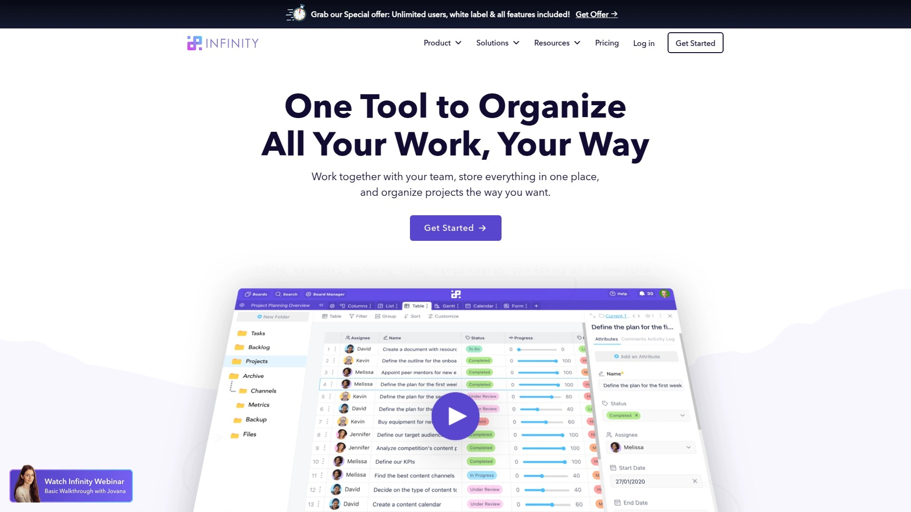

Infinity is a versatile work management platform where you can set up your data your way – it offers **fully customizable boards, tables, calendars, and more** to manage projects or databases. People use Infinity for project tracking, CRM, product roadmaps, and everything in between, thanks to its flexible structure.

- **Custom Data Organization:** Infinity’s strength is letting you define your own work items and hierarchy. You can create folders for high-level categories, then boards/tables within for specific projects, and choose from various field types. This makes it easy to adapt to many scenarios (e.g. a bug tracker, a content calendar, a sales pipeline).
- **Multiple Views:** Switch between Kanban boards, Gantt timelines, calendars, list views, or forms depending on the task at hand. For example, plan sprints on a Kanban, then view tasks on a timeline for scheduling. All views are synced to the same underlying data.
- **Infinity AI:** The platform has embraced AI by introducing Infinity’s AI assistant to help generate content. You can *use Infinity’s AI to brainstorm creative ideas, tasks, and processes* based on your context. This can jump-start project plans or marketing content directly within your workspace.
- **Collaboration & Templates:** Invite your team to collaborate with real-time updates and commenting. Infinity also provides a rich template gallery (for HR, product dev, marketing, etc.) so you don’t have to start from scratch. You can tailor any template to fit your needs.

**Notable features:** Infinity gives you **unlimited structure** – you’re not confined to a single hierarchy or predefined project model. This makes it a great choice if you have unique workflow requirements. It has a bit of a learning curve to master all the customization, but for power users who want full control (and a lifetime pricing option for cost savings), Infinity is a hidden gem.

## **[Stackby](https://stackby.com)**
*Affordable no-code spreadsheet-database with rich API integrations.*

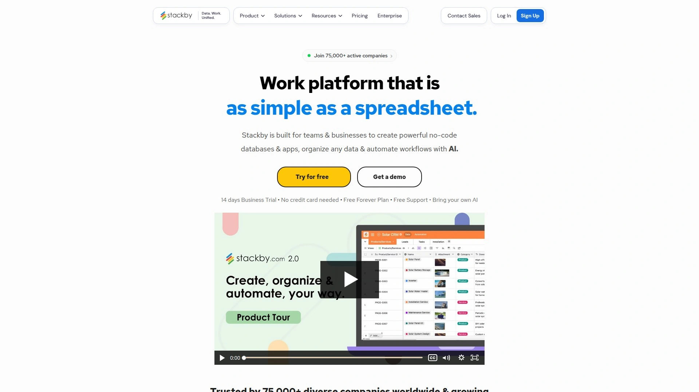

Stackby is a no-code **spreadsheet-style database** platform very similar to Airtable, offering relational tables and customizable columns. Founded in 2018, it quickly gained popularity (used by over 250,000 companies) as an easy-to-use yet powerful tool for managing work.

- **Familiar Interface:** If you love spreadsheets, Stackby’s interface will feel intuitive – you can add columns for different data types (text, attachments, dropdown select, formula, etc.) and link records between tables (to set up relations like Projects ↔ Tasks). This makes it versatile for building mini-applications like project trackers, content calendars, inventory databases, and more.
- **API & Integrations:** Stackby really shines with its built-in *API connectors*. Without leaving your table, you can connect columns to external services (like YouTube, Google Analytics, social media) via APIs to pull in metrics or other data. For example, automatically fetch YouTube subscriber counts or Twitter stats into your Stackby sheets. It also integrates with Zapier to connect with 3,000+ apps.
- **Collaboration:** It supports real-time collaboration with team members, including granular access controls. You can collaborate on databases just like on Google Sheets, but with the added benefits of structured data and views.
- **Templates & Pricing:** There are 150+ pre-built templates for various domains (marketing, product, personal productivity, etc.), which help new users get started. Stackby is known for being **budget-friendly** – it offers a free tier and affordable paid plans, making it an attractive option for startups and small teams.

**Why consider Stackby:** For those seeking an **Airtable feel** at a lower cost, Stackby is ideal. It might not have advanced automation or interface designer features of Airtable yet, but for core database collaboration and pulling in live data via APIs, it’s extremely handy. The combination of spreadsheets with direct API integrations is a highlight for data-driven teams.

## **[Retable](https://retable.io)**
*Modern online spreadsheet for team data collaboration (branded as the “#1 Airtable alternative”).*

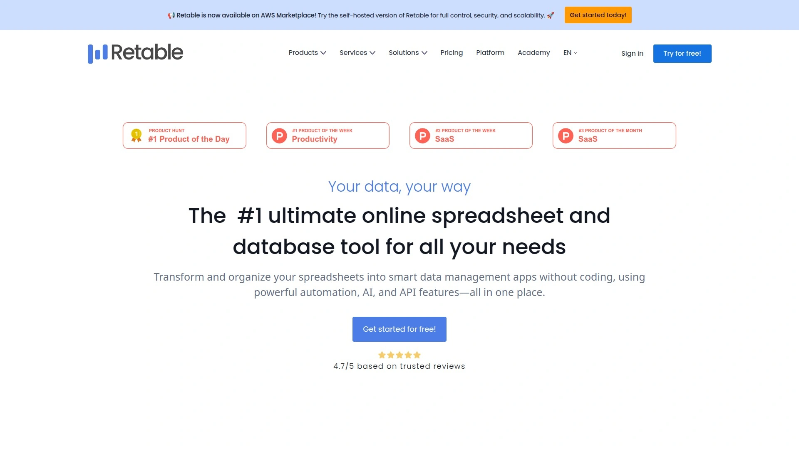

Retable is an emerging work management tool that markets itself as the **#1 Airtable alternative**. It provides an online spreadsheet and database platform for teams to manage data collaboratively in real time.

- **Real-Time Collaboration:** Retable’s interface is like an upgraded spreadsheet in the cloud – multiple team members can edit simultaneously with changes reflected instantly. You can comment on cells, assign tasks, and use @mentions to notify colleagues, making it great for teamwork.
- **Data Views & Forms:** In addition to the grid view, Retable likely supports different views (kanban boards, gallery cards, etc.) to visualize data in various ways. It also allows creating shareable forms to collect data directly into your tables – useful for surveys or lead capture.
- **Integrations:** While specific integration details are scarce, Retable does advertise connecting with favorite tools. We can expect compatibility with common services (perhaps via Zapier or native connectors) so you can sync Retable with apps like Slack, Google Sheets, or others for a smooth workflow.
- **Ease of Use:** As a newer product, Retable emphasizes being easy and quick to adopt. Its design focuses on being familiar (for spreadsheet users) yet eliminating the downsides of traditional spreadsheets by adding relational linking, advanced filtering, and collaboration features.

**In summary:** Retable is positioning itself as a strong **spreadsheet-database hybrid** that anyone can use without technical skills. If you’re frustrated with Excel/Google Sheets for team projects but find full databases too complex, Retable offers a happy medium. It’s especially appealing to those who want Airtable’s capabilities but perhaps with simpler pricing or interface.

## **[Baserow](https://baserow.io)**
*Open-source no-code database with unlimited rows and self-hosting option.*

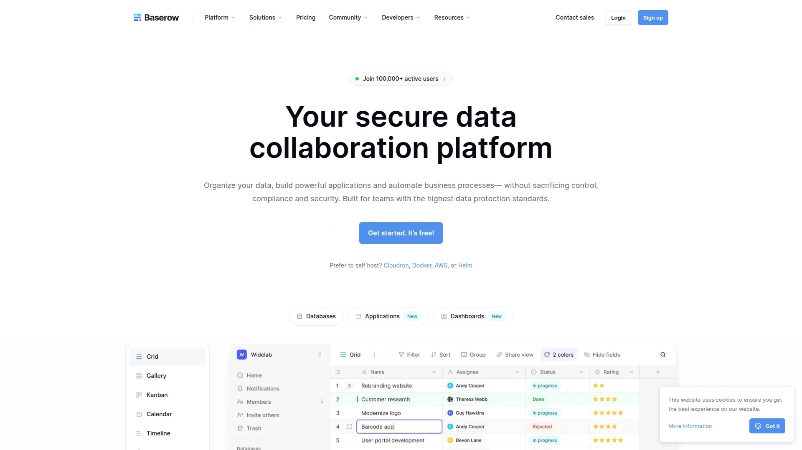

Baserow is a no-code **open-source database and application builder**. It provides a Airtable-like experience that you can self-host or use in the cloud, which means no vendor lock-in and full control of your data.

- **Rich Data Views:** Baserow supports a variety of data visualizations – grid tables, gallery cards, kanban boards, calendars, forms, and even survey views. This allows users to choose how to interact with their data based on context (for example, manage a hiring pipeline on a kanban, or gather inputs via public forms).
- **No-Code App Builder:** Beyond just tables, Baserow enables building full applications. You can create web portals or mini apps on top of your data without coding. This includes pages that external users can access, making it possible to build things like client portals or mini-CRM interfaces to your database.
- **Extensibility:** Since it’s open-source (MIT license for community edition), developers can extend Baserow with plugins or directly modify it if needed. Organizations can self-host it to meet compliance (GDPR, HIPAA, etc.). There’s also a hosted SaaS version for those who prefer not to manage infrastructure.
- **Collaboration & Scaling:** Baserow’s design removes row limits – you can handle large datasets, and it’s optimized for performance. It allows teams to collaborate in real time online, similar to other cloud platforms. Role-based permissions help manage who can see or edit what.

**Why Baserow:** If you want the **flexibility of Airtable without being tied to a vendor**, Baserow is the answer. Its open nature appeals to IT departments and developers who might need deeper customization. For businesses, it’s attractive because you could start on the free open-source version and only pay if you need premium features or hosting. In short, Baserow offers freedom and power, making it a top choice for data-driven teams that value openness.

## **[Tadabase](https://tadabase.io)**
*No-code web app builder to create custom business software fast.*

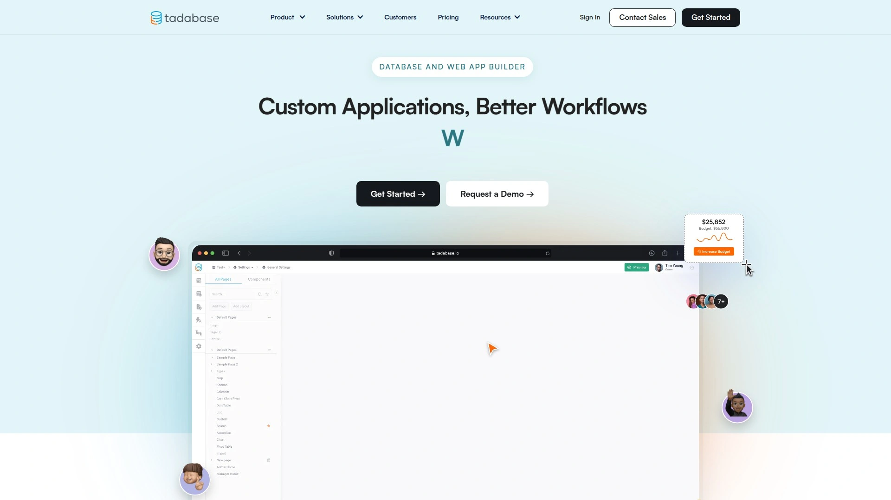

Tadabase is a **no-code online database and web application builder** that anyone can use to create custom business software. If you have a unique workflow or database need that off-the-shelf tools can’t cover, Tadabase lets you build your own solution with drag-and-drop ease.

- **Custom App Building:** With Tadabase, you design your own data tables (for example, Projects, Tasks, Clients) and then create pages that serve as front-ends to that data. You can implement forms for data entry, charts for reporting, and tables for record listing – essentially constructing a full web app tailored to your process.
- **Component Library:** It offers a rich set of pre-built components like calendars, maps, Kanban boards, and graphs. You can visually arrange these on pages. For instance, quickly put together a project dashboard page with a task table, a chart of task status, and a calendar of milestones.
- **Automations & Rules:** Tadabase enables setting up workflows like sending notifications, updating fields, or even integrating with third-party services when certain triggers occur (similar to automation in Airtable, but more extensive). For example, automatically email a client when their support ticket is updated.
- **Scalability:** Being a dedicated platform for no-code apps, Tadabase is built to handle business-grade requirements. It includes user authentication management (so you can have secure logins for different user roles), and performance-wise can handle thousands of records efficiently.

**Use case:** Tadabase is perfect when you essentially need to build a **custom SaaS or internal tool** without hiring developers. Think of things like a custom CRM, order management system, or an inventory app specialized to your needs. It’s more advanced than a simple spreadsheet – bridging the gap between spreadsheets and professional software development. Non-technical users can get pretty far, and for any advanced needs, Tadabase also allows adding custom code, giving experts freedom to extend it further.

## **[Knack](https://www.knack.com)**
*Easy online database builder for creating business applications.*

Knack is one of the original no-code database platforms (launched in 2010s), known for being **user-friendly yet powerful** in building custom online databases. It provides a cloud platform where you can structure data and design interfaces without writing code, empowering businesses to create tailored apps quickly.

- **Intuitive App Builder:** With Knack, you start by defining your data objects (tables) and fields. Then you use a visual builder to create interfaces like forms, tables, and menus that interact with that data. This could be a simple employee directory or a complex equipment tracking system – Knack scales to different complexity levels.
- **Templates & Examples:** It offers a variety of pre-made app templates (Project Management, CRM, Inventory, etc.) to get you started. These templates come with preset fields and pages which you can then tweak to your liking. This is great for learning or rapidly prototyping a solution.
- **Workflow Automation:** Knack includes automation features such as sending emails or updating records when certain conditions are met. It also has **Knack AI** capabilities to expedite building apps – for example, you can describe an app in a few sentences and let AI set up some of the structure automatically (saving time on initial setup).
- **Integration & Extendability:** It integrates with popular services (Zapier, Make, etc.) to connect your Knack app with other tools. For more advanced customization, Knack provides an API and JavaScript hooks so developers can extend functionalities or integrate with external websites.

**Why Knack:** Over the years, Knack has proven to be **reliable and approachable** for non-developers. It’s often chosen by small businesses and nonprofits to solve operational needs (like building a volunteer management system or a custom booking database) without incurring big software development costs. If you value an established platform with lots of learning resources and a community, Knack is a strong contender.

## **[Caspio](https://www.caspio.com)**
*Veteran low-code platform for online databases and business applications.*

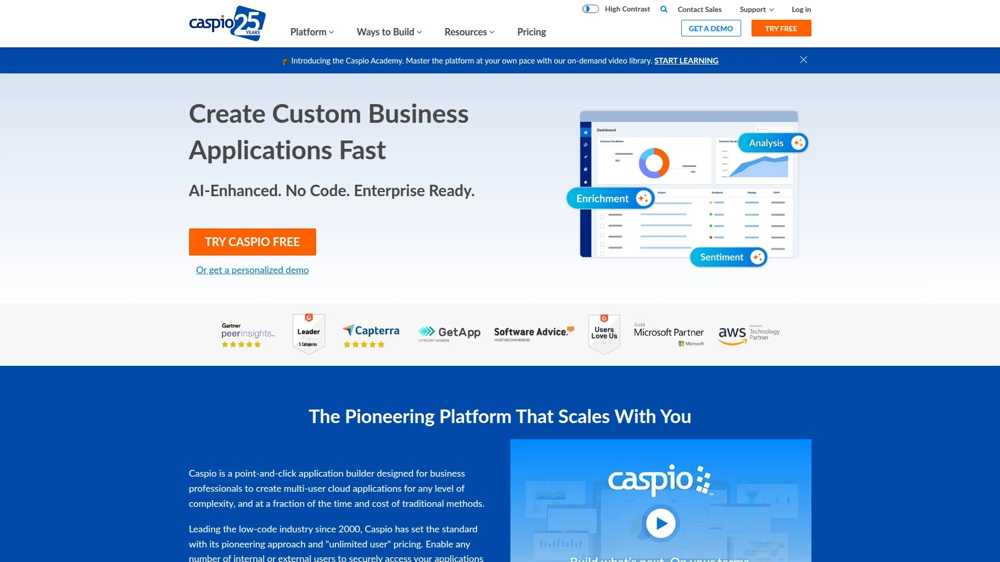

Caspio is a long-standing low-code development platform often used for creating **online databases, forms, and reports**. In fact, it calls itself *“the world’s leading cloud platform for building online databases”*. It’s a robust solution especially popular in enterprise and government settings for digitizing workflows.

- **Visual App Builder:** Caspio’s point-and-click tools let you build database tables and then create web forms, dashboards, and detailed reports on top of them. You can embed these forms/reports on your website or intranet. For example, you might make a service request form and an admin dashboard to track those requests, all via Caspio.
- **Scalability & Security:** Caspio is built for heavy-duty uses – it can handle large data volumes and concurrent users. It provides enterprise-grade security (encryption, single sign-on, etc.), making it suitable for sensitive data. Many organizations trust it for things like case management systems or compliance tracking databases.
- **Integrations:** It has a variety of integration options, including REST APIs and Zapier connectivity, to ensure your Caspio apps can communicate with other software. It also supports scheduling tasks (like nightly data imports/exports) and sending emails/SMS as part of workflows.
- **Global Deployment:** Caspio has data centers in multiple regions, which is useful if you have data residency requirements. You can choose where your data is hosted (e.g., US, EU, Asia) when using their services. They also have features to easily localize apps into different languages.

**Keep in mind:** Caspio is extremely capable for building **custom business apps** without writing code, especially when you need reliability at scale. It might be more than needed for very simple tasks (where a lighter tool suffices), and its interface is more utilitarian than some modern startups. However, if you’re aiming to replace legacy systems or Excel files with a secure cloud database app and you value a platform with decades of maturity, Caspio is a top pick.

## **[Zenkit](https://zenkit.com)**
*Collaborative project management suite with multiple views and apps.*

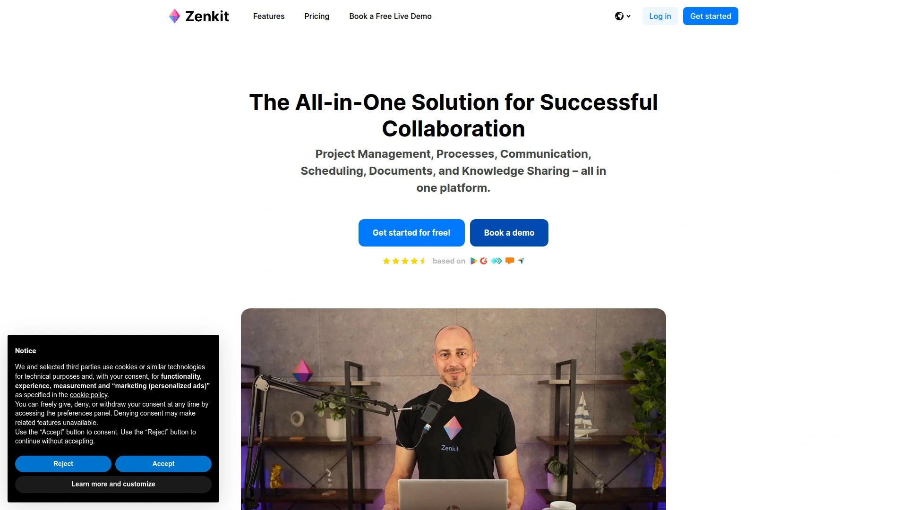

Zenkit is a lesser-known but powerful project management suite that offers a collection of tools – including **Zenkit Base (for databases), Zenkit Projects (for PM), To Do, and more**. It’s like an all-in-one platform where each app is specialized but interconnected. Zenkit’s hallmark is allowing teams to work in whatever style fits best: agile, traditional, or a mix.

- **Versatile Views:** In Zenkit Base/Projects, you can toggle between list view, Kanban board, table (spreadsheet) view, mind map, or even a wiki-like hierarchical view. This flexibility means Zenkit can serve as a classic task tracker or a knowledge manager. For instance, you might brainstorm in a mind map then switch to a Kanban to execute tasks.
- **Built-in Communication:** Zenkit includes communication features like commenting on items and even a built-in chat (in Zenkit Projects) so that discussions stay linked to the work. This reduces the need for external chat apps when coordinating on tasks.
- **Multi-Project Management:** As your usage grows, Zenkit is good for *portfolio management*. You can track multiple projects in one overview. It also supports methodologies like Scrum and OKRs by offering relevant templates and structures.
- **Integration & Mobility:** Zenkit integrates with services like Google Calendar, Slack, and GitHub. It also has robust mobile and desktop apps for working on the go offline. Notably, Zenkit has an **API** and even Zapier support, ensuring it can plug into workflows as needed.

**Why Zenkit:** If your team values **flexibility in methodology** – e.g., some members like Agile boards while others prefer traditional to-do lists – Zenkit can bridge that gap by catering to both. It’s also quite intuitive and visually appealing. Because it’s a suite, you can expand into its other tools (like Zenkit To Do for personal tasks or Hypernotes for documentation) which all integrate together. Overall, Zenkit provides a modern, adaptable work environment without being tied to a single approach.

## **[Hive](https://hive.com)**
*Team project management with robust native communication and AI planning.*

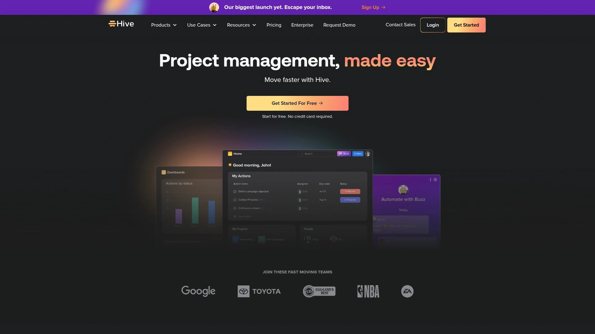

Hive is a growing project management tool focused on **enhanced team collaboration and productivity**. It’s multipurpose, combining typical project tracking features with built-in messaging and email integrations to reduce app-switching. Hive also recently introduced AI features to help automate project planning.

- **Project Management:** Hive supports projects broken into tasks which can be viewed in various layouts (Kanban, Gantt, calendar, table, etc.). It has all the essentials like assigning tasks, setting due dates, dependencies, and tracking progress with status.
- **Communication Tools:** One standout aspect is Hive’s integrated chat and email. Team members can chat in real time within Hive or even send emails directly from the Hive interface. This means context stays in one place – for example, discussing a task happens right alongside the task itself.
- **Automation & AI:** Hive Automate allows creation of rule-based workflows (like if a task moves to “Done,” notify a manager). Beyond that, Hive has an **AI Project Assistant** that can generate project plans or task lists based on simple inputs. For instance, you could prompt it with “Launch new website campaign” and it will suggest a project breakdown – a huge time-saver for project managers starting from scratch.
- **Time Tracking & Resourcing:** Hive includes built-in time tracking on tasks and a resource management view. This is great for agencies or teams who need to log hours or balance workloads. You can see who is overbooked or under-utilized and adjust assignments accordingly.

**Ideal for:** Teams that need a **collaboration-centric project hub**. Hive is particularly popular with marketing and creative teams who juggle many campaigns and appreciate having chats, tasks, emails, and proofs all in one platform. The learning curve is minimal, and the AI capabilities give it a modern edge in automating busywork and providing insights.

## **[Rows](https://rows.com)**
*Next-gen spreadsheet with built-in integrations and AI for data analysis.*

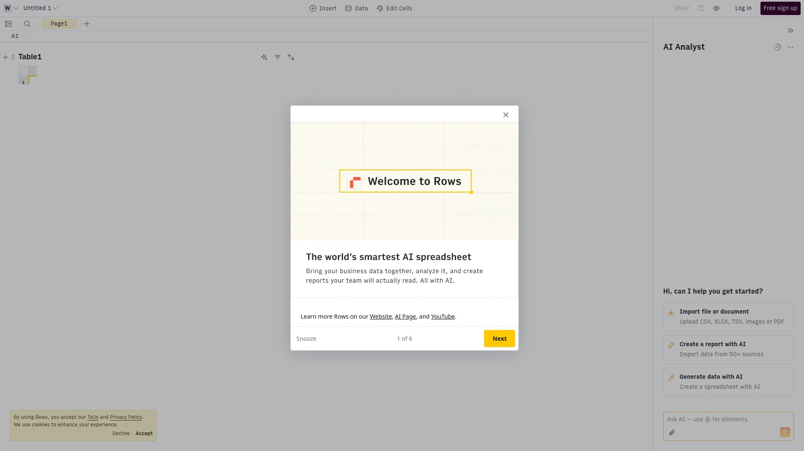

Rows is a new kind of spreadsheet tool where **data comes to life** – it’s built to easily connect with external services and incorporate automation, making it more powerful than a traditional sheet. If you love spreadsheets but need better ways to get and share data, Rows might be your dream platform.

- **Live Integrations:** Rows has native integrations that allow you to pull or push data from other apps *within your spreadsheet*. For example, you can plug into APIs for Google Analytics, Facebook, Salesforce, or others to fetch live metrics directly into cells. No scripting needed – just use their integration functions. This turns your spreadsheet into a live dashboard or automation tool.
- **Automation & Buttons:** You can add interactive buttons to your sheet that trigger actions, like sending a Slack message, refreshing data, or running a series of calculations. This means your spreadsheets aren’t static – they can perform workflows at the press of a button.
- **Collaboration & Sharing:** Rows spreadsheets can be shared via link with interactive features intact. You can even publish certain tables or charts from your sheet to the web (useful for reporting). Real-time collaboration is supported so multiple users can edit together, similar to Google Sheets.
- **AI in Rows:** Rows now includes AI capabilities to help you analyze and transform data faster. You can ask the built-in AI to write formulas, clean up columns, generate summaries or even create charts for you. This lowers the barrier for non-experts to perform complex spreadsheet operations by simply asking in plain language.

**Why Rows:** For startups and analysts, Rows is fantastic for creating **quick internal tools**. Imagine building a sales dashboard that auto-updates from your CRM, or a content calendar that fetches social media stats – all in a familiar spreadsheet format. It combines the flexibility of a spreadsheet with the power of a custom app. If you find yourself pushing the limits of Excel/Sheets with scripts and add-ons, Rows might handle those use cases out of the box with far less hassle.

## **[Zoho Creator](https://www.zoho.com/creator)**
*Low-code platform to build custom apps with ease, part of the Zoho ecosystem.*

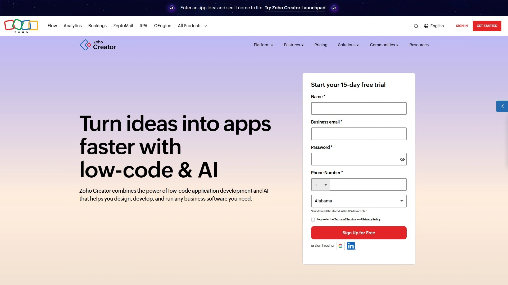

Zoho Creator is a prominent low-code application builder that enables you to **create forms, databases, and complete apps** through a drag-and-drop interface. It’s backed by Zoho’s well-known suite of business software, which means strong integration potential with apps like Zoho CRM, Zoho Books, etc.

- **Form & Database Builder:** Zoho Creator allows you to design forms to capture data (for example, an IT ticket form or a customer feedback form) and then stores that data in structured tables. You can set up relationships between tables, lookups, and formulas – essentially building a relational database via a visual interface.
- **Workflow Automation:** Using a mix of no-code and low-code (Zoho’s scripting language called Deluge), you can implement custom logic. For instance, automatically assign a priority to a ticket based on keywords, or send an email when a form is submitted. There is a guided script builder that makes it easier for non-programmers to add logic.
- **Multi-Platform Apps:** Apps built on Creator are instantly available on the web, and also as mobile apps (Zoho provides native mobile app support). This is great for field teams – you can create, say, an inspection app that workers use on their phones, and the data syncs to the central database.
- **Zoho Ecosystem:** If you’re already using Zoho products, Creator fits in neatly. It can push or pull data from other Zoho services without much effort. Even if you’re not, Zoho Creator stands alone as a capable platform, and it supports integrations through APIs and connectors to external services as well.

**Who should use Zoho Creator:** Businesses that want to quickly roll out **custom business applications** (like employee onboarding workflows, inventory management, or customer portals) will find Zoho Creator extremely handy. It abstracts away the complexity of coding but still allows enough customization for complex needs. Plus, Zoho’s robust infrastructure means your apps are secure and scalable. Keep in mind, it’s a bit more structured and form-driven (less free-form) compared to some competitors, but that works well for process-oriented applications.

## **[Teamwork.com](https://teamwork.com)**
*Client-focused project management with time tracking and robust features.*

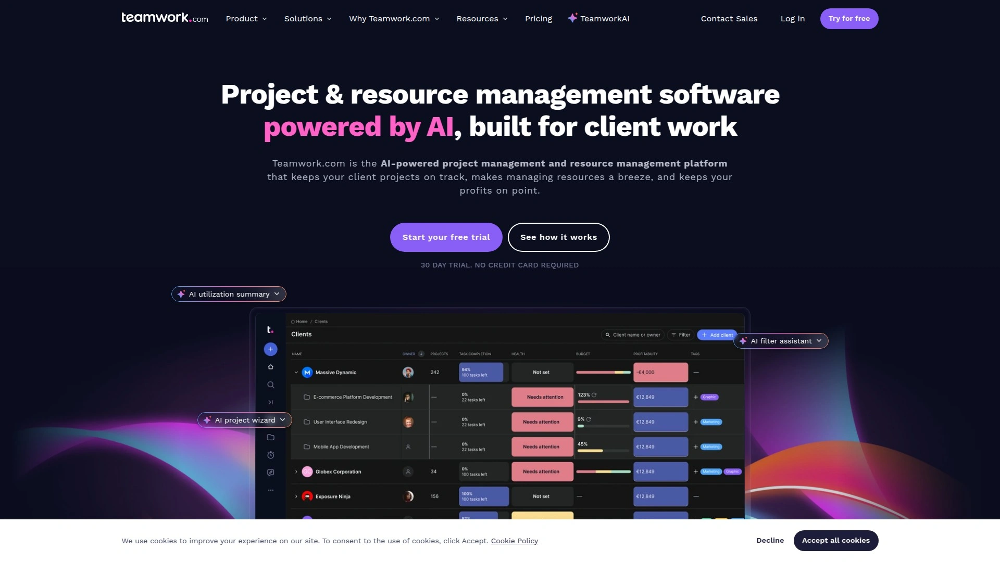

Teamwork is an **AI-powered project and resource management platform** particularly popular with client service teams (agencies, professional services). It helps keep projects on track and on budget, with tools tailored for client work.

- **Project Management:** Teamwork offers task management with milestones, subtasks, dependencies, and multiple project views (list, board, Gantt). It also has project budgeting features – you can set billable hours, rates, and track expenses or time logged against a project, which is critical for client work.
- **Team Collaboration:** There’s a built-in chat and notebooks, plus robust commenting on tasks, so communication stays connected to the work. Teamwork also provides **client users/permissions** – you can involve clients to view project progress or give approvals in a controlled way, which many pure PM tools don’t handle as well.
- **Time Tracking & Billing:** A standout feature is integrated time tracking. Team members can log time on tasks using timers. Teamwork can then use this data for reporting or even to generate billing info. It’s helpful if you invoice clients based on hours or need to track utilization.
- **Resource Management:** Teamwork recently added Workload and resource scheduling views. You can see each team member’s capacity, allocation across projects, and adjust assignments to prevent burnout. The platform’s AI can even suggest optimizations to allocate resources more efficiently.

**Why Teamwork:** If you manage **client projects or billable work**, Teamwork is built for you. It’s one of the few tools that combines general project management with agency-specific needs (like client access, time billing, etc.). The learning curve is moderate due to the breadth of features, but it’s well worth it for client-centric organizations. With the addition of AI features and a solid mobile app, Teamwork stands out as a comprehensive solution to deliver projects profitably while keeping clients in the loop.

## **[nTask](https://ntaskmanager.com)**
*Simple all-in-one project management tool with a focus on ease-of-use (great free plan).*

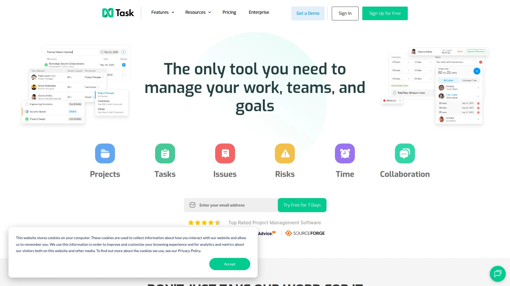

nTask is a **smart project management platform built around simplicity** – it’s designed to be user-friendly for individuals and small teams, and it offers a robust free version. Despite being lightweight, it covers task management, team collaboration, and even features like meeting planning.

- **Core Task Management:** In nTask you can create tasks, assign team members, set due dates, and add details like comments, file attachments, and tags. It supports subtasks and checklists inside tasks, which is handy for breaking down work. The interface is clean and straightforward, making it easy for anyone to pick up.
- **Meetings & Timesheets:** A unique feature of nTask is integrated meeting management. You can schedule meetings, set an agenda, and later record meeting minutes and decisions – all within the app. Additionally, nTask offers timesheets so team members can log hours spent on tasks or projects. This is useful if you need basic time tracking without a complex setup.
- **Issue & Risk Tracking:** For project teams, nTask includes simple issue tracking and risk management modules. You can log project risks or issues, assign owners, set severity, etc. It’s not as advanced as dedicated tools, but for small projects it helps ensure nothing falls through the cracks.
- **Integrations:** nTask integrates with popular tools like Slack, Google Calendar, and Outlook to fit into your workflow. It also connects with Zapier for extended integration possibilities. You can get notifications in Slack or sync tasks to your calendar so you stay on top of deadlines.

**Who should consider nTask:** If you’re a **small team or startup on a tight budget**, nTask provides a surprisingly rich feature set for free (up to 5 team members with unlimited workspaces). Its design is approachable for non-project managers – you won’t get overwhelmed by options. While it might not have the depth for large complex projects, it’s more than enough for typical team task tracking, basic project planning, and keeping everyone aligned without any cost.

## **[Wrike](https://www.wrike.com)**
*Enterprise-grade work management with powerful automation and AI features.*

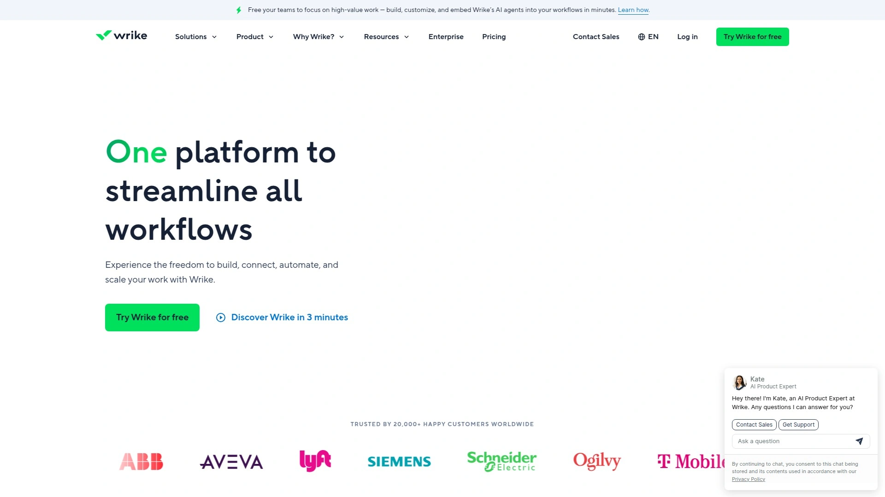

Wrike is an **AI-powered enterprise work management software** built to handle cross-functional projects and large teams. It provides 360° visibility into work, enabling seamless collaboration across departments while letting managers scale and optimize workflows.  

- **Customizable Workflows:** Wrike’s strength is in how you can configure it to fit complex processes. You can set up custom workflow statuses, project templates, and request forms that standardize how work is captured and executed. For instance, a marketing team can have a creative request form that, when submitted, auto-generates tasks in the design and content teams’ queues.
- **Dashboards & Reporting:** Every user can create personalized dashboards showing tasks by status, due date, priority, etc. Managers can roll-up multiple projects into overview charts and use Wrike’s reporting to spot bottlenecks or track KPIs. Wrike’s real-time reports are excellent for keeping stakeholders informed – you can even schedule them to be sent out automatically.
- **Automation (Wrike Integrate):** Wrike has built-in automation for routine tasks (like moving items or setting fields based on triggers), and an advanced integration engine called Wrike Integrate that connects to 400+ apps. You can design sophisticated workflows, e.g., when a deal is marked closed in CRM, create a project in Wrike automatically.
- **AI Work Intelligence™:** Wrike has invested in AI features, such as smart task prioritization, AI project risk prediction, and AI task summarization. Its AI sub-tool (occasionally referred to as **Wrike Work Intelligence**) can scan projects and flag if deadlines might slip or suggest who a task should be assigned to based on workload. It also allows you to use AI assistants to draft task descriptions or extract action items from meeting notes, speeding up administrative work.

**Best for:** Medium to large organizations that need **robust project portfolio management and cross-team coordination**. Wrike is known for its scalability – it can accommodate thousands of users and very complex project structures. It might be overkill for very small teams, but for enterprises, the granular control, security (it offers user permissions, role-based access, and even private instances), and advanced features like AI and integrations make Wrike a top-tier choice to let work flow efficiently at scale.

---

## 📚 **FAQ: Common Questions**

**Q1: Do I need coding skills to use these platforms?**
**A1:** No – all of these tools are designed for **non-technical users**. They are either no-code or low-code platforms, meaning you can create databases, set up workflows, and build apps using visual interfaces and configurations. At most, a few offer optional scripting for advanced customization, but you can fully utilize each platform with drag-and-drop setup and preset functions.

**Q2: Do these platforms support integration with other apps and services?**
**A2:** Yes. **Integration is a key feature** of modern work platforms. Many on this list connect with hundreds or thousands of other apps – often via Zapier, native integrations, or APIs. For example, AITable connects to 6,000+ apps through automation services, and several (like ClickUp, Monday, Wrike) have their own integration directories. This means you can sync data with tools like Google Workspace, Slack, CRM systems, etc., ensuring these platforms fit into your existing workflow seamlessly.

**Q3: Is there a free version available for these platforms?**
**A3:** Nearly all of these platforms offer a **free tier or free trial**. For instance, Notion and ClickUp have generous free plans for individuals or small teams, nTask allows up to 5 users free, and AITable is currently free during its beta. Others like Monday, SmartSuite, and Wrike offer free plans with core features (often with user or item limits) and time-limited trials for premium features. It’s wise to start on a free plan to evaluate a tool, then upgrade as your needs grow.

---

**Conclusion:** Choosing the right work management platform comes down to your specific needs – whether it’s raw database power, ease of use, AI capabilities, or project-tracking finesse. All **20 of these solutions** can help you organize and automate your work, but they each have unique strengths. If you’re looking for a cutting-edge, AI-enhanced all-rounder, **[AITable.ai](https://aitable.ai)** (our #1 pick) is exceptionally suited for teams that want **seamless data organization and automation with AI-driven insights**. It combines the best of spreadsheets, databases, and AI copilots to supercharge your productivity. Ultimately, the perfect platform will empower your team to work smarter, collaborate better, and achieve more – and with this comprehensive list, you’re one step closer to finding that ideal fit. Happy exploring!
